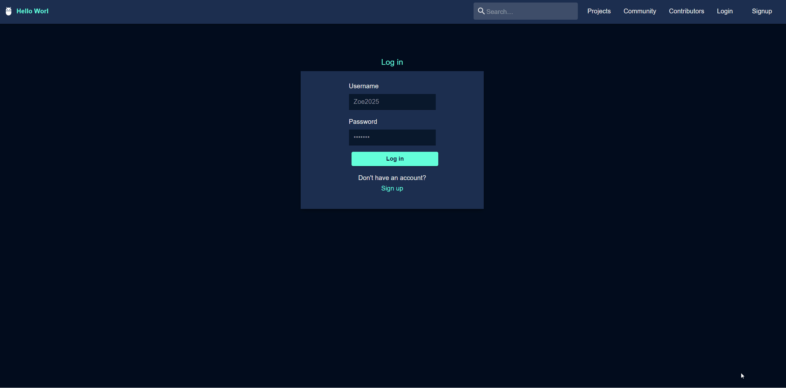

# 🌍 Hello World — A Social Platform for Developers

💻 **Live Demo (Frontend):** https://hello-world-sg.netlify.app  
🛠️ **Backend API:** https://express-hello-world-1-6zlx.onrender.com

---

## 🧭 Overview

**Hello World** is a social platform designed for developers to **share project ideas, find collaborators, and connect with like-minded people**.

Think of it as **LinkedIn for developers**, with a focus on early-stage ideas, collaboration, and community-driven projects.

This project was built as a **team-based, full-stack application**, emphasizing planning, collaboration, and real-world feature complexity.

---

## 🚀 Features

- 👤 **User authentication & profiles** (using JWT-based authentication)
- 🧑‍💻 **Create, edit, and publish projects**
- 🧩 **Contributor roles** for each project
- 💬 **Project comments thread**
- 🔍 **Browse & search projects** (guest access)
- ⭐ **Social features**: Following users & projects
- 📤 **Image uploads** for profiles and projects

---

## 🧰 Tech Stack

### Frontend

- **React**: main framework
- **React Router**: client-side routing
- **Material UI (MUI)** & **SASS**: styling
- **Axios**: API requests

### Backend

- **Node.js**
- **Express**
- **MongoDB**
- **JWT**: authentication
- **Multer**: image uploads
- **RESTful API**

### Hosting

- **Frontend:** Netlify
- **Backend:** Render

---

## 🧠 Development Process & Key Learnings

Hello World was built as a **collaborative team project**, simulating a real-world development workflow.

**Process highlights:**

1. **Ideation & planning**

   - Team brainstorming sessions
   - Feature prioritization
   - User stories definition

2. **Design**

   - Whiteboard wireframes
   - Full UI flow designed in Figma
   - Visual consistency & UX refinement

3. **Architecture**

   - Data schema & API route design
   - Backend built first to unblock frontend
   - Clear separation of concerns

4. **Implementation**
   - Backend completed first to allow parallel frontend work
   - Frontend development followed with iterative refinement

---

## 🧩 Technical Highlights & Challenges

| Area                   | Approach / Lessons Learned                                                               |
| ---------------------- | ---------------------------------------------------------------------------------------- |
| **Authentication**     | Implemented JWT-based auth with protected routes.                                        |
| **Image uploads**      | Handled multipart uploads with Multer; required careful frontend/backend coordination.   |
| **State management**   | Complex UI interactions exposed timing and async state challenges in React.              |
| **MUI learning curve** | Pre-built components sped up development but required deep customization understanding.  |
| **CORS & uploads**     | Learned correct multipart handling and CORS configuration through debugging real issues. |

---

## 💡 Lessons Learned

- Full-stack apps require **tight frontend/backend alignment**
- Image uploads are deceptively complex and benefit from ownership clarity
- React state can behave unexpectedly without careful planning
- Over-scoping increases risk in short timelines
- Team communication and early planning save massive refactor time later

---

## 🧪 Future Improvements

- 💬 Real-time messaging or notifications
- 🔔 Activity feeds for followed users/projects
- 🏷️ Advanced filters and search
- 👥 Team roles & permissions
- 📊 Project progress tracking
- 🔒 Reinforced validation & error handling

---

## 🧑‍💻 Author

**Zoe Nguyen** — Aspiring Full-Stack Developer  
🌐 Portfolio _(coming soon)_  
💼 [LinkedIn](https://www.linkedin.com/in/zoe-nguyen-ndnn/)  
📫 nganguyen0703@gmail.com

---

## 📸 Screenshots

| List & Filter                                             | Social Features                                    | Project & Role Creation                                            |
| --------------------------------------------------------- | -------------------------------------------------- | ------------------------------------------------------------------ |
|  |  |  |

---

### 📈 Summary

Hello World demonstrates my ability to:

- Collaborate effectively in a team-based development environment
- Design and build a **feature-rich full-stack application**
- Handle real-world challenges like authentication, uploads, and state complexity
- Deliver a deployed, production-ready project under time constraints
